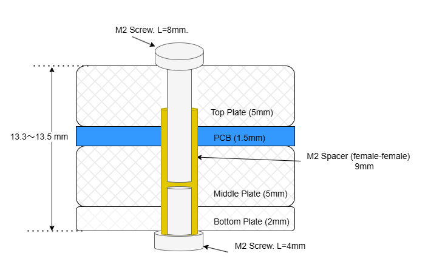

# レーザーカット アクリルプレートと PCB アセンブリ

このディレクトリは、アクリル板を使った3種類のプレートの寸法(*.pdf)と、発注用のカットアウト図 (*.dxf) を含んでいます。

このダイアグラムは、PCB とアクリルプレートを含むマルチレイヤー構造のアセンブリ構成を示しています。

* プレートと PCB
  * トッププレート (5mm): アセンブリの最上層は 5mm 厚の透明アクリルプレートです。
  * PCB (1.5mm): トッププレートの下に位置するのは 1.5mm 厚の PCB です。
  * ミドルプレート (5mm): PCB の下に位置するのは 5mm 厚のマット透明アクリルプレートです。
  * ボトムプレート (2mm): アセンブリの最下層は 2mm 厚の透明アクリルプレートです。

* 固定部品
  * M2 スクリュー (8mm): アセンブリの上部を固定するために使用します。
  * M2 スクリュー (4mm): アセンブリの下部を固定するために使用します。
  * M2 スペーサー (オス-メス, 9mm): 9mm 長の M2 スペーサーが 2 本のスクリュー間に配置されます（下部から）。
